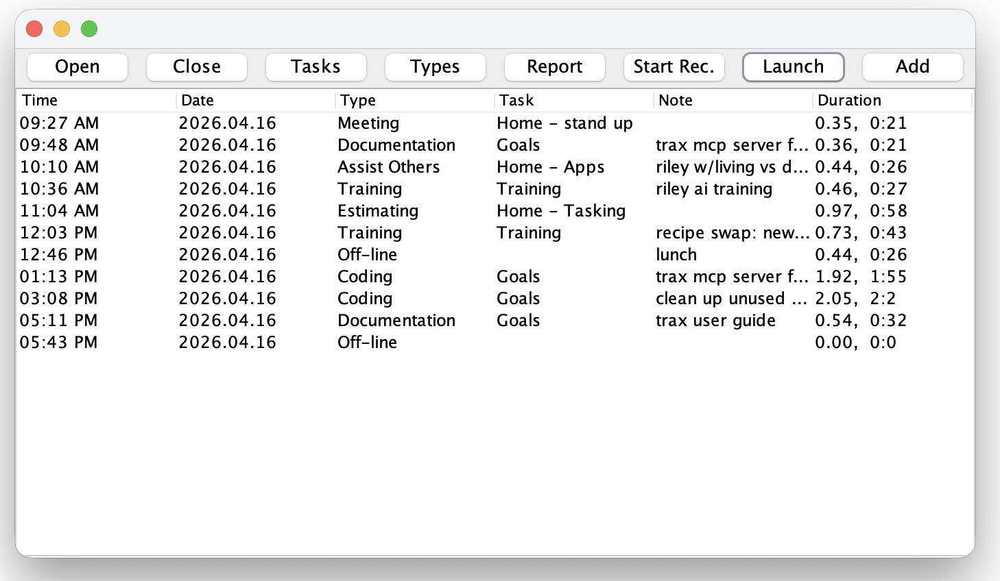
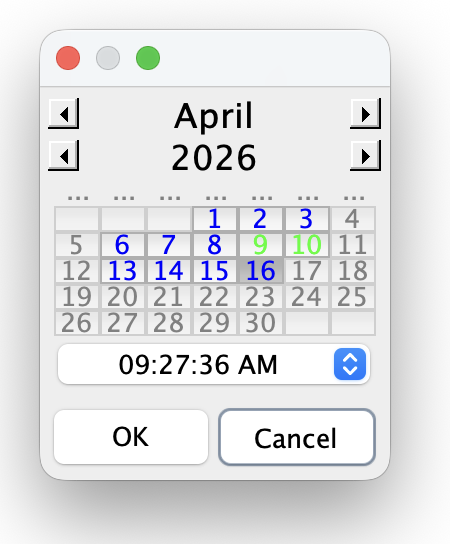
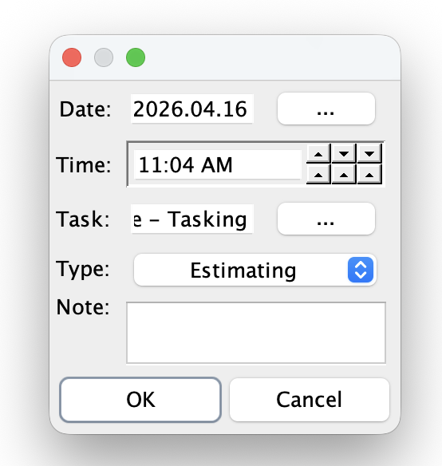
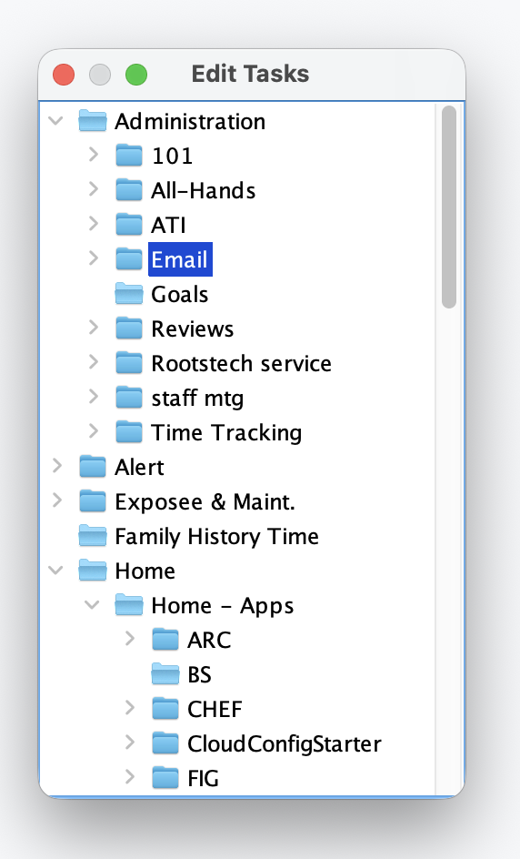
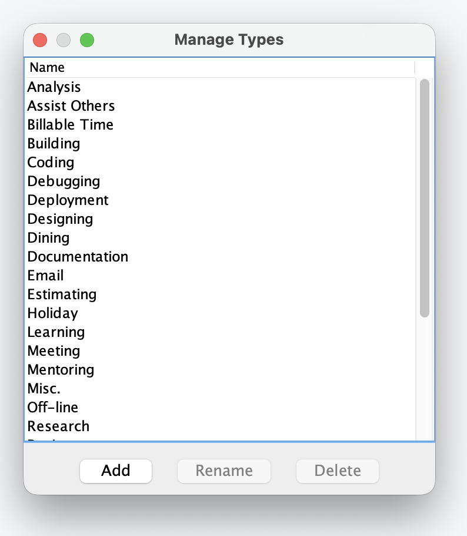
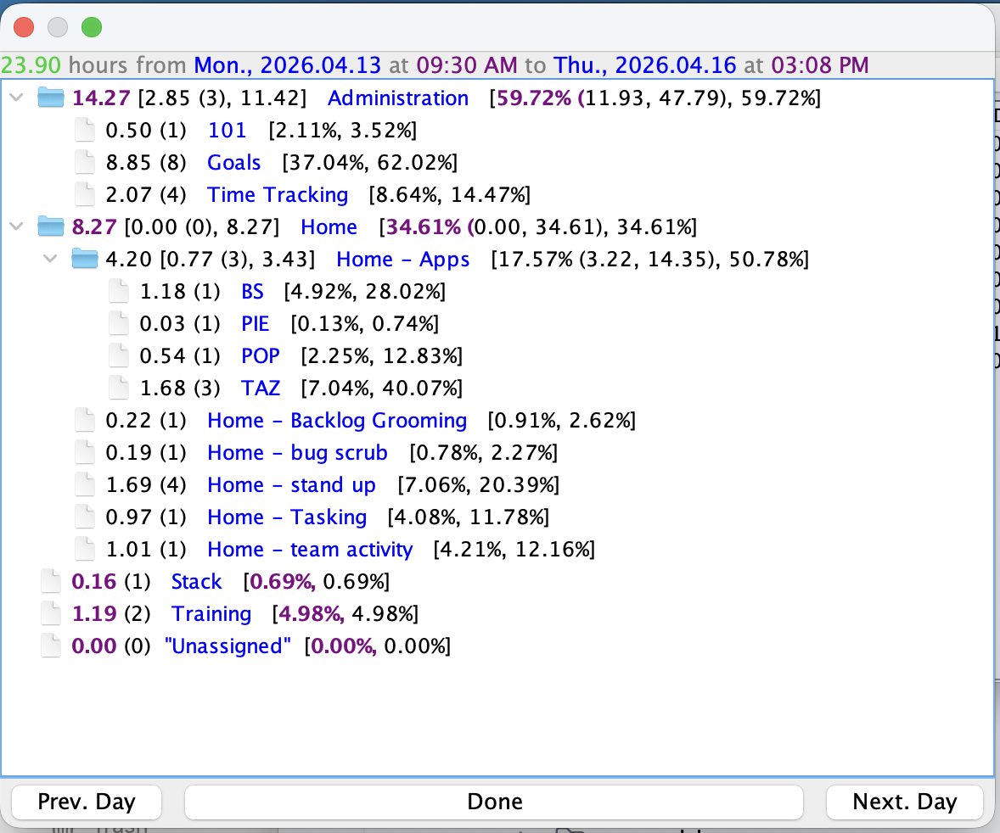

# Trax User Guide

Trax is a desktop time-tracking application for recording daily work activity. This guide covers the Swing UI.

## Main Window



The main window shows the current timeline as a table of timeslices. Each row is a time interval with columns:

| Column   | Description |
|----------|-------------|
| Time     | Start time of the slice |
| Date     | Start date of the slice |
| Type     | Activity type (Coding, Meeting, etc.) |
| Task     | Associated task, if any |
| Note     | Optional note |
| Duration | Length of the interval (decimal hours, then hours:minutes) |

### Toolbar Buttons

| Button     | Description |
|------------|-------------|
| Open       | Open an existing timeline by selecting a date from a calendar |
| Close      | Close the currently displayed timeline |
| Tasks      | Open the task manager to create, edit, or organize tasks |
| Types      | Open the type manager to add, rename, or delete activity types |
| Report     | Open a report (see [Reports](#reports) below) |
| Start Rec. | Start recording a new day: creates a new timeline and first slice at the current time |
| Launch     | Add a new slice at the current time to the open timeline (your "next activity" button) |
| Add        | Add a slice with a manually chosen start time to the open timeline |

### Right-Click Menus

Right-clicking on a **timeslice row** shows options including:

- **Edit** -- edit the selected slice's time, type, task, and note
- **Insert** -- insert a new slice at the selected row's position
- **Delete** -- delete the selected slice(s)
- **Continue** -- add a new slice that copies the selected slice's type, task, and note

Right-clicking on **empty space** below the table shows general timeline options.

## Typical Daily Workflow

1. **Start your day:** Press **Start Rec.** to create a new timeline. An editor opens for the first slice -- set the activity type, task, and note, then press OK.

2. **Switch activities:** Press **Launch** each time you change tasks. This stamps the current time, calculates the previous slice's duration, and opens the editor for the new slice.

3. **End your day:** Press **Launch** one more time, set the type to **Off-line**, and press OK. Then press **Close** to close the timeline.

4. **Catch up later:** If you were away and need to fill in time manually, use **Add** to append slices or right-click and **Insert** to place a slice at a specific position.

## Opening a Timeline



Press **Open** to show the calendar dialog. Days with recorded timelines are shown in color:

| Color    | Meaning |
|----------|---------|
| Blue     | Normal work day |
| Green    | Vacation day |
| Magenta  | Sick leave day |
| Yellow   | Holiday |
| Orange   | Mix of vacation, sick, or holiday |
| Red      | Multiple timelines on that day |
| Black    | No timeline (day is not selectable) |

Use the arrow buttons to navigate months and years. Click a colored day to select it, then press OK.

## Editing a Timeslice



The slice editor lets you set:

- **Date** -- press "..." to open a calendar picker
- **Time** -- hour and minute of the slice start
- **Task** -- press "..." to open the task selector (double-click a task or press OK to select; shift-click to deselect, then press OK to remove a task from the slice)
- **Type** -- activity type dropdown
- **Note** -- free-text note for the slice

## Task Manager



Press **Tasks** to open the task manager. Tasks are organized in a tree hierarchy. Right-click a task for options:

- **New Sub Task** -- create a child task
- **Edit** -- rename or change the task's type
- **Delete** -- delete the task (only if not referenced by any timeslice)
- **Move** -- reparent a task under a different parent
- **Complete** -- mark the task as completed (hides it from the default view)

## Type Manager



Press **Types** to manage activity types. Types are categories like Coding, Meeting, Email, etc.

- **Add** -- create a new type
- **Rename** -- rename the selected type (double-click also works)
- **Delete** -- delete the selected type (only if not used by any timeslice or task)

The Off-line and Misc. types are protected and cannot be renamed or deleted.

## Reports

Press **Report** to choose from five report types:

### Timeline Type Summary

Shows time for the current timeline grouped by activity type (Coding, Meeting, etc.).

### Timeline Task Summary

Shows time for the current timeline grouped by task.

### Period Type Summary

Prompts for a date range, then shows time grouped by activity type across all timelines in that period.

### Period Task Summary

Prompts for a date range, then shows time grouped by task across all timelines in that period.

### Period Task Composite Summary



The most detailed report. Shows a hierarchical breakdown of time by task across a date range, with subtask rollups. Use **Prev. Day** and **Next. Day** to shift the period.

Each line in the report has two sections:

#### Hours (left of the task name)

For **leaf tasks** (no subtasks):

```
1.18 (1)  BS
```

- `1.18` -- total hours on this task
- `(1)` -- number of timeslices

For **parent tasks** (with subtasks):

```
8.27 [0.00 (0), 8.27]  Home
```

- `8.27` -- total hours (direct + subtask time)
- `0.00` -- hours logged directly on this task
- `(0)` -- number of slices logged directly
- `8.27` -- hours contributed by subtasks

#### Percentages (right of the task name)

For **leaf tasks**:

```
BS  [4.92%, 28.02%]
```

- `4.92%` -- this task's time as a percentage of the entire report period
- `28.02%` -- this task's time as a percentage of its parent task's time

For **parent tasks**:

```
Home  [34.61% (0.00, 34.61), 34.61%]
```

- `34.61%` -- total time as a percentage of the entire report period
- `0.00` -- direct time as a percentage of the entire report period
- `34.61` -- subtask time as a percentage of the entire report period
- `34.61%` -- total time as a percentage of the parent task's time

For top-level tasks, the last percentage equals the first since their parent is the report root.